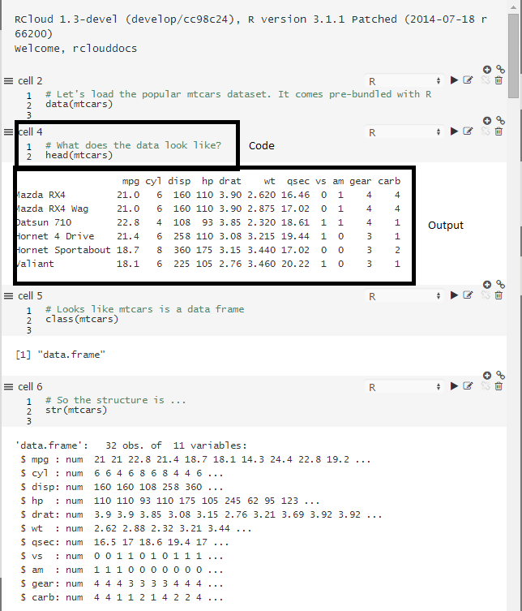
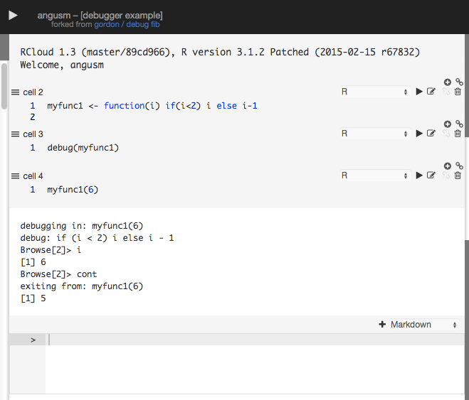
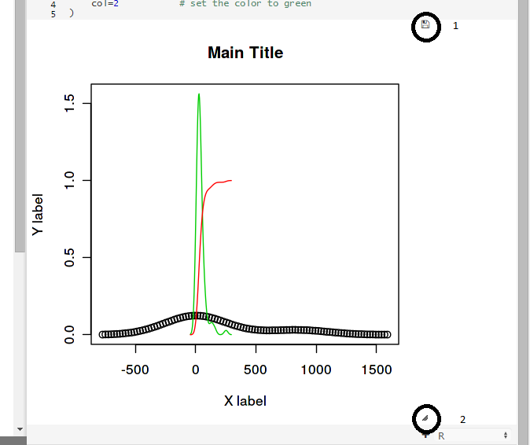
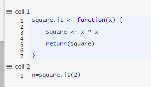

<h1> {{page.title}} </h1>

Created 2015-02-14. **What's New!** contains a list of new features, GUI enhancements and bug fixes.  RCloud documentation is currently maintained by <a target="_blank" href="http://www.spencerseidel.com">Spencer Seidel</a> on a voluntary basis.

## Table of Contents

1. [Functional Enhancements](#functional)
    * [Efficient Loading](#efficientloading)
    * [RMarkdown Cells](#rmarkdowncells)
    * [Failed Searches](#failedsearches)
    * [Shareable Links](#shareablelinks)
    * [Better Workspace Value Display](#betterworkspacevaluedisplay)
    * [Page Reloads](#pagereloads)
    * [visit.html Logo](#visitlogo)
    * [Line Breaks](#linebreaks)
1. [GUI Enhancements](#gui)
    * [Cleaner Interface](#cleanerinterface)
    * [Cell Run-State Indicator](#cellrunstateindicator)
    * [Non-Preemptive Stop](#nonpreemptivestop)
    * [Editable Cell Color](#editablecellcolor)
    * [Auto Indentation](#autoindentation)
    * [Code and Output](#codeandoutput)
    * [Direct Input and Output](#directinputandoutput)
    * [Saving Plots](#savingplots)
    * [Big Plots](#bigplots)
    * [Search and Replace](#searchandreplace)
    * [Notebook Information Icon](#notebookinformationicon)
    * [Startup Animation](#startupanimation)
    * [Years](#years)
    * [Right-Clicking Search Results](#rightclickingsearchresults)
    * [Arguments for User-Defined Functions](#argumentsforuserdefinedfunctions)
    * [Terse Dates](#tersedates)
    * [Extensions](#extensions)
    * [Comments Subscriptions](#commentssubscription)
    * [Cell Numbers](#cellnumbers)
    * [Reordering Cells](#reorderingcells)
    * [Clicking in Edit Cells](#clickingineditcells)
1. [Technical Enhancements and Notes](#tech)
    * [Extenstions to RCloud User Interface](#extensionstorclouduserinterface)
    * [RCloud Language Add-Ons](#rcloudlanguageaddons)
    * [shared.R](#sharedr)
    * [Redis Database Number and Password](#redisdatabasenumberandpassword)
1. [Bug Fixes/Improvements](#bugfixes)

## 1. Functional Enhancements

### Efficient Loading

After loading a notebook, cells do not activate the editor until they are clicked on. This makes loading notebooks with a large number of cells more efficient and therefore faster.

[Top](#top)

### RMarkdown Cells; Experimental Support

Experimental support for RMarkdown cells is included.  Old Markdown cells use the [markdown](http://cran.r-project.org/web/packages/markdown/index.html) and [knitr](http://yihui.name/knitr/) packages directly for output; RMarkdown cells use [rmarkdown](http://rmarkdown.rstudio.com/) (a.k.a. R Markdown v2).

[Top](#top)

### Failed Searches

If you enter a search term that contains a SOLR/Lucene syntax error, for example, "bad:", RCloud will output a message about syntax and include a link to Lucene query parser syntax.

[Top](#top)

### Shareable Links

If you tag a version of your notebook, load it, and then select one of the shareable links, RCloud will populate the URL with the tag instead of the version. This is beneficial because then you can tag a different version of the same notebook and pre-existing URLs won't point to the wrong version of the notebook.

[Top](#top)

### Better Workspace Value Display

Workspace values are displayed simply and more accurately.

[Top](#top)

### Page Reloads

If a change in settings requires a reload, RCloud will indicate that a reload is necessary.

[Top](#top)

### visit.html Logo

The logo used in visit.html is customizable.

[Top](#top)

### Line Breaks

When displaying R stack traces, RCloud uses line breaks.

[Top](#top)

## 2. GUI Enhancement

### Cleaner Interface

The RCloud team has put a lot of work into creating a new cleaner interface, reducing visual clutter. Please, let us know what you think!

[Top](#top)

### Cell Run-State Indicator

The run-state of each cell is displayed via an icon in between the gutter and cell name:

: Cell has not been run

: Cell is scheduled to be run

: Cell is running

: Cell has run successfully

: Cell ran but had errors

: Cell's run was cancelled

[Top](#top)

### Non-Preemptive Stop

When you run a notebook, you can prevent scheduled cells from running by pressing the stop button, located in the header at the top of the screen:

Note that this will not interrupt currently running cells (). It will only prevent scheduled cells from running.

[Top](#top)

### Editable Cell Color

Editable cells are lightly colored.

[Top](#top)

### Auto Indentation

R and Python cells have automatic indentation.

[Top](#top)

### Code and Output

Most cells show both the code and the output. Output is shown when the cell is run.  Click on the code or the edit code icon in cell's status bar to activate the cell's edit mode.

Markdown cells behave slightly differently - since the markdown output already contains the code, the code editor is hidden when the markdown is run.  Click on any code (not markdown) within the markdown output, or click on the edit code icon in the status bar to activate it.

[Top](#top)

### Direct Input and Output

When you execute a notebook, cells are executed asynchronously, so output for individual cells will appear as it becomes available.

Code can also request lines of input. E.g. `readline` works - as does `browser` and `debug` for debugging purposes.  Ordinary code cells do not use knitr/markdown for output but send images, pre-formatted, and html output separately.

E.g.

And the result:

For debugging:

[Top](#top)

### Saving Plots

Hover the mouse over a plot created in an R cell to make the disk icon appear in the upper right corner (see 1), which contains a list of available image formats.  A widget at the lower-right corner can be used to resize the image (see 2).

[Top](#top)

### Big Plots

RCloud displays a horizontal scrollbar when plots that are too wide to display completely in the middle column.

[Top](#top)

### Search and Replace

Users can search/search-place across all cells in a notebook.

Ctrl/Cmd-F opens the find bar at the top of the notebook.  Type to search incrementally.

Ctrl-H (Win, Linux), Cmd-Option-H (Mac) opens the replace bar.

[Top](#top)

### Notebook Information Icon

Clicking the notebook information icon shows which users have starred a notebook.

[Top](#top)

### Startup Animation

RCloud displays an animated icon when first loading a notebook.

[Top](#top)

### Years

When versions are more than a year old, the year is displayed in the notebook version dates.

[Top](#top)

### Right-Clicking Search Results

Users can right click on search results to open results a new tab.

[Top](#top)

### Arguments for User-Defined Functions

Function arguments are shown in the Workspace panel.

Given the following user defined function:

The arguments are displayed in the Workspace panel:

[Top](#top)

### Terse Dates

There is an option to turn off "terse dates" in the Options panel.

[Top](#top)

### Extensions

You can enable and disable per-user extensions using the "Enable Extensions" and "Disable Extensions" text boxes. These set the user options `addons` and `skip-addons`, respectively. On starting the session, any extensions listed in `skip-addons` are not loaded.

[Top](#top)

### Comments Subscription

If your server is set up to allow subscribing to comments, the Subscribe to Comments option will appear in the settings panel:

[Top](#top)

### Cell Numbers

Cell number is shown above each cell in its status area.

You can turn off this feature in the settings panel:

[Top](#top)

### Reordering Cells

Users can grab the status area above cell as well as the gutter area () in order to reorder cells. This allows users to move cells when not editing them.

[Top](#top)

### Clicking in Edit Cells

Clicking into an edit cell sets the cursor position to the clicked location.

[Top](#top)

## 3. Technical Enhancements and Notes

### Extensions to RCloud User Interface

There are many ways to write extensions to the RCloud user interface. For more information, see [the wiki](https://github.com/att/rcloud/wiki/RCloud-UI-Extensions).

[Top](#top)

### RCloud Language Add-Ons

Administrators can add cell languages. R, RMarkdown, and Python evaluation is performed by language add-ons. For more information see [the wiki](https://github.com/att/rcloud/wiki/RCloud-Language-extensions).

[Top](#top)

### shared.R

'shared.R' can be used to serve static content out of of the 'www/' folder of any installed R package. This enables many Shiny packages, which can include javascript, css, and images.

[Top](#top)

### Redis Database Number and Password

redis database number and password can be set.

[Top](#top)

## 4. Bug Fixes

* Unauthenticated login functionality with view.html, shiny.html, notebook.R is working correctly.
* `fork_of` is not missing.
* The backspace key doesn't cause your browser to go to the previous page.
* Clicking on the last writable notebook does not edit the title.
* Cell or command-prompt never overlap.
* Extensions cannot cause non-GUI applications to break.
* Deleted assets are not displayed.
* If a plot is resized too small, RCloud restores previous size and does not report this (harmless) error.
* The Dataframe panel clears when loading a new notebook.
* Deleted comments are not included in search.
* Loading a notebook by ID does not fail if a whitespace appears at the end.
* Notebooks are saved before forking.
* Importing notebooks does not cause the browser title to change.
* Messages from the server are not fragmented and do not produce "Invalid typed array length" error or silent failures.
* knitr does not produce duplicate plots.
* Prior notebooks are not loaded if the current one cannot be loaded.

[Top](#top)
