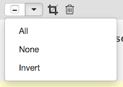
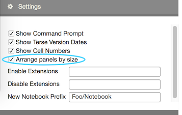

<h1> {{page.title}} </h1>

Created 2016-07-18. **What's New!** contains a list of new features, GUI enhancements and bug fixes. It is currently maintained by [Spencer Seidel](http://www.spencerseidel.com) on a voluntary basis. 

## 1. GUI Enhancements

### Multi-Cell Selection

Multiple cell selection is supported.

1. The notebook header bar contains a checkbox that allows users to select/deselect all cells within a notebook.
2. Users can click a cell's header bar to select a cell -- note that clicking the header bar of an already selected cell does not deselect the cell.
3. Each cell contains a checkbox in the header bar.
4. Click the "crop" icon when cells are selected to delete all **unselected** cells. Click the trash icon to delete all **selected** cells. 

Use the drop-down menu in the notebook header bar to fine-tune your cell selection:

**All**: Select all notebook cells.

**None**: Deselect all notebook cells, even if some are already selected.

**Invert**: Uncheck selected cells, and check all deselected cells.

#### Keyboard extension

Multi-cell selection supports common keyboard extensions:

1. **Shift-clicking** a cell's checkbox will select all cells between the last selected checkbox and the current checkbox.
2. **Ctrl/command-clicking** a cell's checkbox is functionaly equivalent to simply checking a cell's checkbox and is noted because this is a common selection activity.
3. Pressing the **delete key** will delete all selected cells.
4. **Ctrl/command-k** will crop (remove) all unselected cells.
5. **Ctrl/command-Shift-i** will invert the selection (check all unchecked cells and uncheck all checked cells).

[Top](#top)

### Keyboard Shortcuts

Many keyboard shortcuts are supported. To see an exhaustive list, click in a blank area of the RCloud GUI (so that the cursor focus is not in a cell, for example) and then type <kbd>?</kdb>.

[Top](#top)

### Discover

Click the Discover link in the main page header bar to view the most recent and most popular notebooks.

You can create a mini-view of your notebook for this Discover view by creating an asset called `thumb.png`. `thumb.png` will be displayed in the Discover view if present. 

[Top](#top)

### Cell Heights

Cells are shown at the full height of all their text, instead of adding a second level of scrolling. This eliminates the behavior where cells would abruptly get smaller when activated. 

[Top](#top)

### Arrange Panels by Size

In some situations, larger panels on the left-hand side of the GUI "crowd-out" the currently loaded notebook and force the user to resize. In order to minimize this, select the "Arrange Panel by Size" checkbox in the Settings panel. RCloud will then rearrange panels in order to reduce the need for resizing the notebook.

 

[Top](#top)

## 2. Functional Enhancements

### HTML Widgets

[HTML Widgets](http://htmlwidgets.org/) for visualizations are supported in notebooks and mini.html dashboards.

[Top](#top)

### Serving Files from User Libraries

Files can be served from user R libraries via `shared.R/<user>/<package>`. Users can develop packages that use shared.R in their own development library until it is ready to be released.

Note that users are still responsible for setting the permissions on the library path -- default permissions deny access, including the web server, to user libraries.

[Top](#top)

### Partial Notebook Runs

Shift-click the play button on any cell to run only that cell forward in a notebook.

[Top](#top)

## 3. Technical Enhancements and Notes

### Local Single-User Installations

RCloud supports a `exec.auth: as-local` configuration, which uses the current unix user (i.e., the user running the RCloud server) without authentication as the notebook user. It is intended for local single-user installations with gist back-ends that don't provide OAUTH authentications (such as gitgist).

[Top](#top)

### edit.html Loading Time

The initial page load for edit.html is faster, because RCloud loads the notebook tree asynchronously.

[Top](#top)

### Stylesheets

Stylesheets are supported and improve output look and feel.

[Top](#top)

### Find and Replace

Find and replace shows the number of returned results, and the first result is highlighted. Users can perform a reverse search by pressing <kbd>shift-enter</kbd>.

[Top](#top)

### Navigation

Navigating to `edit.html` when not logged in redirects you to the login page, or reinitializes the access token, instead of displaying an error message for something that is not an error.

[Top](#top)

### Mini and Shiny Errors

Errors in `mini.html` and `shiny.html` are displayed in a dialog.

[Top](#top)

### Double Forking

RCloud issues a warning when forking a notebook a second time, as this has no effect. GitHub returns the same notebook when forked twice.

[Top](#top)

### Unsupported Browsers

RCloud issues sensible warnings when accessed with unsupported browsers Internet Explorer and Edge.

[Top](#top)

### Invalid Sources

RCloud displays a list of valid notebook sources if an invalid source is specified in the URL.

[Top](#top)

### notebook.R Headers

`notebook.R` passes an additional entry `.headers` containing the request headers.

[Top](#top)

## 4. Bug Fixes

* <kbd>ctrl/cmd</kbd>-clicking on the New Notebook button opens a new tab with a new notebook.
* <kbd>ctrl/cmd</kbd>-clicking a recent notebook opens it in a new tab
* Code formatting more closely matches look when inactive and in edit mode on Windows and Linux
* Autosave doesn't scroll assets/notebook/cells
* Renaming the folder of the current notebook changes in the notebook name
* Pre-formatted output text from R commands in output context displays with line breaks. Output is consistent with output in notebook cells.
* Leading and trailing spaces are not be allowed for protection groups and asset names, as it can lead to confusion or deception. Spaces at the ends of notebook names are okay.
* Users can open a notebook in GitHub in view mode when running anonymously.
* Users can stop a notebook in view mode when running anonymously.
* Users can remove notebooks through the UI even if it was already deleted on GitHub
* Switching asset tabs on a read-only notebook does not allow editing.
* Browser cacheing does not interfere with renaming assets.
* Deleting the last notebook in a recently opened list does not fail.
* The run button does not continue to blink after a notebook has finished running.
* Notebook trees do not highlight the current notebook in different trees.

[Top](#top)
