User Guide
==========

Latest Version: v2.1

Created 2019-08-24. This **User Manual** contains an in-depth description of
most of the features in the RCloud Graphical User Interface (GUI). It is
currently maintained by [Spencer Seidel](http://www.spencerseidel.com) on a
voluntary basis.

Getting Started
===============

RCloud supports Chrome, Chromium (the open-source version of Chrome), and Firefox web browsers. Download the latest version of any of these to get started.

RCloud stores user notebooks using either GitHub Gist technology, or using the user accounts on a Unix system.

 * **For the public instance at rcloud.social:** new users must have a GitHub account for [rcloud.social](https://rcloud.social/login.R). Please see our Tutorial, [Anonymous User versus Data Scientist Access](https:/rcloud.social/tutorials/), for information about creating an GitHub account.
 * **For a private instance of RCloud:** new users must have a Unix account on the RCloud system. Please refer to your instance's documentation about creating an account.

Since every installation will be different, please refer to your installation's documentation for any relevant environment information.

<a name="partsofthegui"></a>

Graphical User Interface (GUI) overview
=======================================

Parts of the GUI
----------------

The RCloud GUI consists of:

-   A header bar located along the top of the browser window
-   Left and right windowshade panels
-   Prompt and markdown cells located in the center of the screen

<a href="img/GUI_Parts.png"></a>

GUI navigation
--------------

### Opening and closing panels

Clicking on the title of a panel, such as Notebooks and Search, opens, closes,
and in some cases, resizes it.

### Opening and closing all panels

When all RCloud panels are minimized in a column, a "+" sign will appear, as shown here:

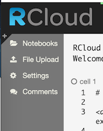

Clicking the "+" sign will restore all panels in the column to their previous sizes. Now, a "-" sign will appear, shown below, which will minimize all open panels in a column.

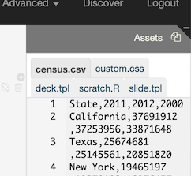

### Changing panel width

To change the width of a panel, hover your mouse over the edge that touches the cells in the middle. When the mouse cursor changes into a double arrow, click and drag left and right to resize.

Header bar
==========

The RCloud header bar is located at the top of the browser window and contains several notebook control icons:

<a href="img/header.png"></a>

: Please see the [Sharing Your Notebooks](#sharing-your-notebooks) section for more information.

: Click the star icon to add the current notebook to your "Notebooks I Starred" folder, shown in the Notebooks panel. The number next to the star represents the number of RCloud users who have starred the notebook.

: Click the fork icon to make a new copy of a notebook for editing.

: Whenever you
run a notebook, RCloud automatically saves a version in GitHub. If you need to
close your RCloud session immediately without waiting for a lengthy run time,
click the save icon to save a version immediately. Note that this icon is only
visible for notebooks you are allowed to save.

: Click the play icon to run all [markdown and prompt cells](#cells) in the current notebook. Cells are executed asynchronously. RCloud displays the output as it becomes available.

: When you run a notebook, you can stop running cells and prevent queued cells from running by pressing the stop button, located in the header at the top of the screen:

This sends an interrupt to the R process and terminates execution if possible.

: This is the title of the current notebook. Click in the title to change it.

Note that you can create subdirectories by adding any number of forward slashes ('/') to your title, similar to a Unix command line. E.g. "Cookbook for R/1 - Basics/1.1 - Indexing into a Data Structure." If the subdirectories don't already exist, RCloud will create them on the fly, so there is no need to create individual subdirectories before changing the name of your notebook. Subdirectories allow you to group your notebooks and will be displayed in a tree-like hierarchy in the [Notebooks section](#notebooks) of the left sidebar.

If a notebook was created as a result of [Forking another notebook](#forking-copying-a-notebook), the forked notebook name is displayed in a smaller font beneath the current notebook's title.

: Depending on
your installation, some users may see a "Forum" link, which will open a new tab
to an RCloud discussion forum.

: Depending on
your installation, some users may see an "About" link, which will open a new tab
with more information about the RCloud platform.

: Click the Advanced drop-down menu to access more [advanced notebook features](#advanced-notebook-features).


: Click the Discover link in the header bar to view the most recent and most popular notebooks.

You can create a mini-view of your notebook for the Discover view by creating an [asset](#notebook-assets) called `thumb.png`. `thumb.png` will be displayed in the Discover view if present.

: Click Logout to end your RCloud session.

Cells
=====

There are two types of cells in RCloud. The first is the **prompt** cell, which
allows you to interact with RCloud in more-or-less command-line fashion. Prompt
cells are useful for quick, interactive sessions.

RCloud supports several cell languages: R, Python2 and 3, and Bash (shell),
which you can specify in the pull-down menu to the right of each cell:


There may be other languages available on your instance, since any Jupyter
kernel is available as an RCloud cell language.

The second type is the **markdown** cell. Markdown cells are better suited for
cutting and pasting chunks of R code and adding simple formatted documentation.
Note that Markdown cells do not currently support Python or Bash.

We'll get to the difference between Markdown and RMarkdown cells in a moment.

"Data marshalling," or sharing results between cells of different languages, is
not supported at this time -- one common workaround is to write and read files.
Also, each "shell" cell represents a separate Unix shell, so environment
variables cannot be passed across shell cells. However, R environment variables
defined in R cells are inherited by shell cells automatically.

Prompt cells
------------

<a href="img/promptcell.png"></a>

Prompt cells mimic an interactive R, Python, or Bash shell. Type a line of code, press `Enter/Return`, and the command is immediately executed. When RCloud is finished, it presents the result and a new prompt cell.

For example, here's the result of pressing `Enter/Return` after typing a command:


Note that after executing a command, RCloud presents several icons that allow you to interact with the cell:

: Run the code in the cell.

: Edit the code in the cell (clicking on your code also enables editing).

: Toggles the
result pane.

: Split the cell into two parts at the cursor.

: Delete the cell.

Another way to interact in multi-line mode with prompt cells is to cut and paste multiple lines of code into the cell. When you do, you'll see something like this:

<a href="img/multilinerpromptpaste.png"></a>

To execute the code, press `Enter/Return`. The whole block of code is executed, wherever the cursor is.

Note that you cannot insert a prompt cell above an existing prompt cell. The only way to add new prompt cells is by executing the current prompt cell. When you do, a new cell is created under the existing one.

### Terminology

Throughout this documentation, prompt cells are sometimes referred to as R cells, Python cells, or Bash cells.

Markdown cells
--------------

<a href="img/markdowncell.png"></a>

### Adding Code

Markdown cells are where you enter and edit blocks of multi-line R markdown. Markdown is a plain-text formatting syntax used to create simple formatted documents. In order to differentiate your R code from text, surround your code with the following (back ticks, brackets and "r"):

    ```{r}
    ## R code goes here
    print("Hello World!")
    ```

For additional information about Markdown, please refer to the [full documentation of Markdown syntax](http://daringfireball.net/projects/markdown/syntax).

When you're done editing a markdown cell, click the  icon to the right of the cell to render the contents of the cell.

Editing and viewing results
---------------------------

If you find a typo or would like to otherwise edit your code, click the  icon. You can also click on any code portions of the output to enter edit mode.

### Navigation

At the beginning or end of a cell's code, use the up and down arrow keys to jump to the next or previous cell.

Adding and deleting cells
-------------------------

To insert a cell above, click the  icon. To insert a cell below, click the  icon. To delete a cell altogether, click the  icon.

Cell run-state indicator
------------------------

The run state of each cell is displayed via an icon in between the gutter and cell name:

: The cell has not been run. This could also mean that the cell ran successfully, but the output may not be consistent with the code in the cell because the code was modified after RCloud initiated a run of your notebook.

: The cell is queued to be run.

: RCloud initiated a run of your notebook, but a cell's code was modified after execution was initiated.

: The cell is running.

: The cell is running, but because the code was modified after notebook execution was initiated, the output may not be consistent with the code.

: The cell ran successfully.

: The cell ran but had errors.

: The cell's run was cancelled.

Stopping cell execution
-----------------------

See the [Header bar](#header-bar) section for more details about stopping cell
execution.

Rearranging cells
-----------------

To rearrange your cells, click and drag the blank status area above the cell.

Joining cells
-------------

To join cells of the same flavor, click the join icon at the right of the cell. This will combine the contents of the cell with the cell immediately above it.


Markdown versus RMarkdown cells
-------------------------------

Behind the scenes, RCloud uses several different R packages to render output. Markdown cells use the [Markdown](http://cran.r-project.org/web/packages/markdown/index.html) and [knitr](http://yihui.name/knitr/) packages directly for output. RMarkdown cells, on the other hand, use [rmarkdown](http://rmarkdown.rstudio.com/) (also known as R Markdown v2).

Saving plots
------------

Hover the mouse over a plot created in an R cell to make the disk icon appear in the upper right corner (see 1), which contains a list of available image formats. A widget at the lower-right corner can be used to resize the image (see 2).

<a href="img/saveresize.png"></a>

Note that you can only save plots created in R cells.

Locators
--------

RCloud supports the standard R [`locator()`](https://stat.ethz.ch/R-manual/R-devel/library/graphics/html/locator.html) function. When the locator is active, RCloud adds a blue border around the plot and changes the cursor to a crosshair.

To add points, left click anywhere on the plot. To end or abort a locator request, press the `Esc` key. Once you have selected your locations, `locator()` returns the points clicked:

<a href="img/locator_res.png"></a>

Locators only work in R cells.

Notebooks
=========

RCloud notebooks are simply collections of prompt and Markdown cells (as well as comments and assets, both of which we'll get to later). Everything in your public notebooks is searchable by every other user of the system. This encourages reuse and makes learning how to use the hundreds of available R packages somewhat easier.

You can also browse everyone else's notebooks by opening the Notebooks section on the left sidebar. To do this, simply click on Notebooks at the top of the panel. This toggles the panel, opening or closing it:


Sorting and filtering notebooks
-------------------------------

Below the Notebooks panel is a header containing two drop-down menus. Click the
left-most button to sort the notebooks panel by name or by date. Click the
right-most button to filter out older notebooks. E.g. Only show notebooks for
the past week, month, year, and so on.

Loading a notebook
------------------

To load a notebook into the current session, click on the name. After it loads, you can examine the source code or click  in the header bar to execute all the cells on the page.

Recent Notebooks
----------------

Access your recently opened notebooks via the Recent link in the Notebooks titlebar:


Creating a notebook
-------------------

To create a new, blank notebook, click the + sign at the right of the Notebooks panel header area:


RCloud will automatically choose a title for your new notebook, Notebook N, where N is the next available number among your notebooks. To give your notebook a more meaningful title, click on the [title in the header bar](#header-bar).

To change the default name of new notebooks, see the [New Notebook Prefixes](#new-notebook-prefixes) section in the Settings panel.

Running a notebook
------------------

To run all the cells in your notebook, click the  icon in the header bar.

RCloud notebooks are executed asynchronously. RCloud will show individual cell results as the results are ready to display.

To run only selected cells, hold down the `Ctrl/Cmd` key when you click the  icon in the header bar. See the [Multi-Cell Selection](#multi-cell-selection) section for more information about multiple-cell selection.

### Partial notebook runs

Pressing the  icon in a cell while holding down the `Shift` key will run that cell and every cell after in order.

Long-running notebooks
----------------------

Notebooks that run longer than a few seconds will cause the browser screen to dim and a please-wait message to be displayed.

Currently, RCloud has no explicit mechanism to stop a long-running notebook. If you mistakenly launch a long-running notebook, you can simply reload the notebook in another browser tab or reload the page. This doesn't stop the execution behind the scenes, but the output of the previous run will not interrupt your current session. Be careful of side-effects, like changing the contents of a file in your local directory in such a way that it affects the output of the notebook.

Forking (copying) a notebook
----------------------------

To copy another user's notebook, first navigate to it using the left sidebar and then click to load it into your current session. Now, you're running another user's public notebook in your own session. This is sufficient for running reports or performing other read-only activities. If you want to edit the notebook, you'll need to make your own copy, or, "fork" it.

After you've loaded the notebook you want to fork, click the Fork icon in the header bar at the top of the screen:


After forking a notebook, you'll own your own copy and be able to edit it.

The fork icon is always available, which means you can fork your own notebooks. If you are viewing a previous version of a notebook, you can fork a copy of that version.

Unfortunately, due to the design of GitHub Gists, when you fork your own notebook, the copy's history is lost. This limitation is not found when using the [rcloud-gist-services](https://github.com/att/rcloud-gist-services) backend.

Saving your work
----------------

### Versioning

RCloud keeps track of your notebook versions automatically and frequently. Every time you save, create, or run a Markdown or Prompt cell, the newest version of your notebook is saved. To browse different versions of your notebook, which are stored chronologically with the latest version on top, hover over the name of your notebook in the left sidebar and click the clock icon. A drop-down list of versions will appear:

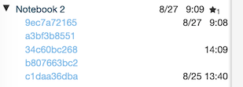

To change they way dates and times are displayed next to your notebook versions, see the [show terse version dates](#show-terse-version-dates) setting.

#### Version Tagging

To tag a notebook version, click twice on a version name to edit it in place.

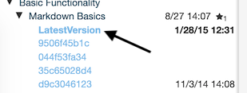

Now, rather than referring to a specific notebook version with `&version=hash` in a URL, you can refer to a specific notebook tag:


`&tag=name`

This is useful when you want to share a version of a notebook but plan to continue developing it. For example, you can tag a version as the "LatestProductionVersion," and then apply that tag to another version when you're ready to share your new work. This way, existing URLs (perhaps stored in someone's bookmarks) won't break as you update your notebooks.

#### Reverting to a previous version

Should you decide that a previous version of your notebook is the "best" version, you can make that version the current version by first loading the desired previous version of the notebook and then clicking the revert icon in the header bar.


Hidden notebooks
----------------

By default, all RCloud notebooks are visible to all RCloud users. If you'd like to toggle the Show/Hide flag on a notebook, hover over the name of your notebook on the left sidebar and click the eye icon. Note that hidden notebook titles are grayed out for owners and invisible to other users.

Hidden notebooks are only invisible within the RCloud interface. Hidden notebooks are still visible within the gists stored in your GitHub instance.

### Toggle hidden

Clicking the  icon will hide your notebook from other RCloud users.

### Toggle show

Clicking the  icon will make your notebook readable by other RCloud users.

Protecting your notebooks
-------------------------

Protected notebooks are readable only by the owner and (optionally) a select group of users and will not show up in search results (although previously unprotected versions can).

### Notebook permissions

View or modify notebook protection by clicking the notebook "info" button next to the notebook name in the notebooks tree:


If you own the notebook, click the "public" link (or "no group" if that displays):

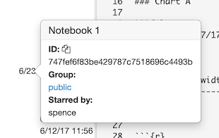

This opens the notebook protection dialog:


Here, you can assign the notebook to any group you are a member of, make it entirely private (readable only by you), or make it public (readable by anyone).

### Groups

Use the second tab of the protection dialog to create or rename groups. Additionally, you can designate other users as group administrators or members. Alternatively, you can select Manage Groups from the Advanced menu item on [the header bar](#header-bar) — note that the Notebook tab will be grayed out in that case, as Manage Groups is not notebook specific.


Unlike a hidden notebook, protected notebooks are not readable by anyone without permission, even within your GitHub instance.

Deleting Notebooks
------------------

To delete a notebook, hover over the name of your notebook in the left sidebar and click the  icon.

RCloud will ask for a confirmation:


Click OK. The notebook will disappear from the left sidebar. The last-viewed available notebook will automatically load into the current session.

Sharing your notebooks
----------------------

There are several ways you can share/view your notebooks. When you click on the downward arrow next to the share icon in the header bar , a popup menu will appear:

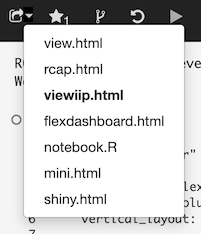

Here, you select the kind of URL you'd like to share. Make your selection using the popup menu and then right click on the  icon to copy the hyperlink.

Clicking on a selection in the sharing menu will open a new browser tab and load the selected link.

Note that if you have a tagged version of your notebook currently loaded, where appropriate, RCloud will populate the shared URL with the tag instead of the version. This is beneficial because then you can tag future versions with the same tag and not break existing URLs.

### `view.html`

This is the simplest method. This will create a link that will allow someone to see the notebook code and execute the notebook within the RCloud IDE. Users who do not own the notebook will see the play  and share  icons in the header. Clicking the play icon will execute all cells in the notebook. Clicking the edit icon will return to the normal header, allowing a user to fork the notebook, etc.

#### Hiding UI Elements

To hide *all* UI elements, add `&quiet=1` to the URL. Note that this works only with `view.html`.

### `flexdashboard.html`

View a notebook containing R Markdown for a [flexdashboard](https://rmarkdown.rstudio.com/flexdashboard/).

### `notebook.R`

This option is intended for [FastRweb](http://rforge.net/FastRWeb/) notebooks. Loading the URL (from anywhere, including other notebooks, a perl script, etc.) executes a notebook "behind the scenes" by opening a one-time R session, running the defined "function" within, shutting down the R session, and finally, returning the result. FastRweb notebooks MUST have a function named `function()` defined, as this is what notebook.R tries to execute upon instantiation. Output from `notebook.R` can be anything (e.g. text, binary data). This information will ultimately be processed by whatever mechanism called `notebook.R`.

`notebook.R` allows trailing paths to be processed by the notebook code if they start with `/.self/`. The subsequent path portion is passed to the run function as the `.path.info` argument. This allows notebooks to handle a "full tree" argument to the notebook on top of a single notebook URL.

E.g.: `https://rcloud.mydomain.com/notebook.R/user/notebook/.self/foo/bar` will call the notebook with `.path.info` set to `/foo/bar`. Note that the `.self` part distinguishes asset look up from a path info call.

See the [notebook.R URLs](#notebook.r-urls) section of the documentation for more detailed information about `notebook.R` URLs.

### `mini.html`

Unlike `notebook.R`, `mini.html` URLs open an R session via a WebSocket and keeps it open. `mini.html` notebooks must have a function named `rcw.result()` defined, as that is what `mini.html` tries to execute upon instantiation. Because the R session is kept open, users or processes can interact with the R session while the websocket is open.

### `shiny.html`

RCloud supports the [RStudio Shiny web application framework](http://shiny.rstudio.com/). To share [Shiny-enabled notebooks](#rstudio-shiny-support), select this option.

Who starred my notebook?
------------------------

To find out which users starred your notebook, click the notebook information icon:


Multi-cell selection
--------------------

You can use RCloud's multi-cell selection features to perform various actions on many cells at once.

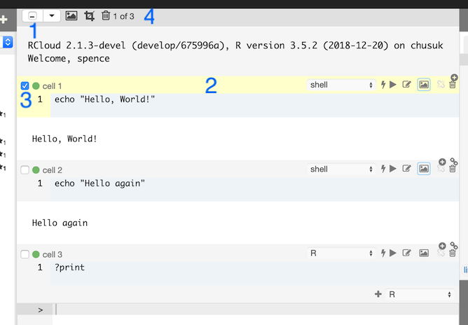

-   At the top of your loaded notebook, you'll find a header bar. Click the checkbox to select/deselect every cell in your notebook (1).
-   Click a cell's header to select that cell. Note that clicking the header of a selected cell does not deselect the cell (2).
-   Click a cell's checkbox to select/deselect that cell (3).
-   Click the  icon to hide the output of selected cells. Note that this feature is only available with your own notebooks (4).
-   Click the  icon to remove every cell that isn't selected (4).
-   Click the  icon to delete all selected cells. Note that RCloud will indicate how many cells are selected out of the total number of cells (4).

Use the checkbox dropdown menu to fine-tune your selection:

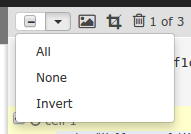

-   **All** selects every cell in your notebook.
-   **None** deselects every cell in your notebook.
-   **Invert** changes every selected cell to a deselected cell and every deselected cell to a selected cell.

Multi-cell selection supports common keyboard extensions:

-   **Shift-clicking** a cell's checkbox will select all cells between the last selected checkbox and the current checkbox.
-   **Ctrl/command-clicking** a cell's checkbox is functionaly equivalent to checking a cell's checkbox and is noted here because it is a common selection activity.
-   Pressing the **delete key** will delete all selected cells.
-   **Ctrl/command-k** will crop (remove) all unselected cells.
-   **Ctrl/command-Shift-i** will invert the selection (select deselected cells and deselect selected cells)

Find and find replace
---------------------

To **find** text within your notebook, type `Ctrl-F` (Win/Linux) or `Cmd-F` (Mac) to open a find dialog at the top of your notebook:


To make a search match the case or use whole words (as opposed to including
partial words inside others), click the elipsis icon next to the Find text box
and make your selection.

To **find and replace** text within your notebook, type `Ctrl-H` (Win/Linux) or `Cmd-Option-F` (Mac) to open a find and replace dialog at the top of your notebook:


## Merging notebooks

To merge two notebooks, start by loading one. Next, in the Notebooks pane, find
the notebook you would like to merge with the currently loaded notebook.

Click the "Merge From" icon next to the notebook you would like to merge:


Alternatively, you can also select "Merge Notebook" from the
[Advanced](#advanced-notebook-features) header-bar
menu. This will open a dialog where you can specify the source of the notebook
to merge. Currently URLs, files, and notebook IDs are supported:


In either case, RCloud presents a Merge dialog. On the left is the list of
assets or cells which need to be changed to merge the two notebooks:


By clicking in that panel, you can choose to accept or not accept the changes
for that file.

Any cells or assets with the same name in both the source and the destination
notebooks will appear as yellow in the left pane:


Choose whether or not to take individual changes to the file in the right pane:


When you're happy with the changes, click the blue Merge button and all the
changes will be applied in one commit to the current notebook. (You can always
Undo and Revert if it didn't work right.)

## Advanced notebook features

Find more advanced notebook features by clicking the Advanced menu in the header
bar.


-   **Open in GitHub**: Internally, notebooks are stored as GitHub "gists."
    Depending on your installation, you can view your notebook gist within
    GitHub directly. This entry is grayed out for installations using the
    [RCloud Gist Service](https://github.com/att/rcloud-gist-services) because
    it isn't implemented yet.
-   **Merge Notebook**: Merge changes from another notebook into the currently
    loaded notebook. Please see the [Merging notebooks](#merging-notebooks) section
    for more information.
-   **Load Notebook by ID**: Replace the current notebook with another via URL
    or gist ID.
-   **Pull and Replace Notebook**: Opens a dialog box where you can tell RCloud
    to copy the contents of an existing notebook (within the same RCloud
    instance) via URL, file, or ID and replace the contents of the current
    notebook.
-   **Import External Notebooks**: Opens a dialog where you can import multiple
    notebooks stored in another GitHub repository. You'll need the source GitHub
    repository API URL and a list of notebook IDs, newline separated. In
    addition, you can supply a prefix that will cause all the imported notebooks
    to go into a folder. E.g. "myfolder/". Note that a trailing '/' character is
    required for this to work.
-   **Export Notebook to File**: Your browser will automatically save a copy of
    the current notebook in JSON format in whatever directory you've designated
    for downloads. The file name will be the same as your notebook with a
    `.gist` extension.
-   **Import Notebook from File**: In order to import a notebook, it must be in
    either `.gist` (see above) or `.R` (see below) format. You can validate the
    notebook by clicking the word "Validate." To import, click the Import
    button.
-   **Export Notebook as R Source File**: Your browser will automatically save a
    copy of the current notebook as an R source text file in whatever directory
    you've designated for downloads. The file name will be the same as your
    notebook with a `.R` extension.
-   **Manage Groups**: Opens the Notebook Permissions / Group Management dialog,
    where you can [manage your groups](#protecting-your-notebooks).
-   **Publish Notebook**: By default, users who wish to view your notebooks must
    be logged into RCloud. If the Publish Notebook box is checked, *any* user
    who has network access to the notebook's URL will be able to view the
    notebook. Editing features will be turned off for these users.
-   **Import Rmarkdown File**: Imports Rmarkdown containined in a `.Rmd` file.
-   **Export Rmarkdown File**: Your browser will automatically save a copy of
    the current notebook as an `Rmd` text file in whatever directory you've
    designated for downloads. The file name will be the same as your notebook
    with a `.Rmd` extension.
-   **Import Jupyter Notebook**: Imports a [Jupyter notebook](https://jupyter.org/) from your local file system.
-   **Export as Jupyter Notebook**: Exports a [Jupyter notebook](https://jupyter.org/) as an `.ipynb` file to your local file system.


Data access
===========

There are many ways to access data in RCloud. We'll cover the options available in the GUI here, but be sure to browse the "RCloud Sample Notebooks" section of the Notebooks panel for ideas.

File upload
-----------

Open the File Upload panel on the right sidebar by clicking on the heading. Then, select "Choose Files" and browse to a local file.

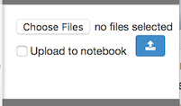

Next, click the "Upload" button. If the file exists, RCloud prompts with a notice that it will be overwritten. If all goes well, RCloud confirms the upload.

The file now exists in your installation server's home directory and is accessible from within RCloud. For example:


The first line of R code loads the contents of the CSV file into an object called "mydata." The next line tells R to output a string version of the object.

Upload to notebook
------------------

The **Upload to Notebook** checkbox changes the way File Upload works. Rather than uploading your file to your home directory, RCloud will store the file inside your notebook as an "asset." To view notebook assets, click on the Assets panel on the right sidebar. Please see the [Notebook Assets](#notebook-assets) section for more information.

Notebook assets
===============

Notebooks can contain "assets," which are files that can be used within your notebooks or simply for keeping track of unused code (as in the the case of `scratch.R`, which is a text file where you can keep bits of code while working on your notebook).

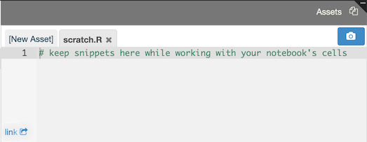

Data as an asset
----------------

For example, here is the content of a file called distrib.csv:

    a,1
    b,15
    c,4

We can store this data in a new asset called `distrib.csv` simply by clicking New Asset and typing `distrib.csv` as a name.

Now, this data is accessible in your R code:

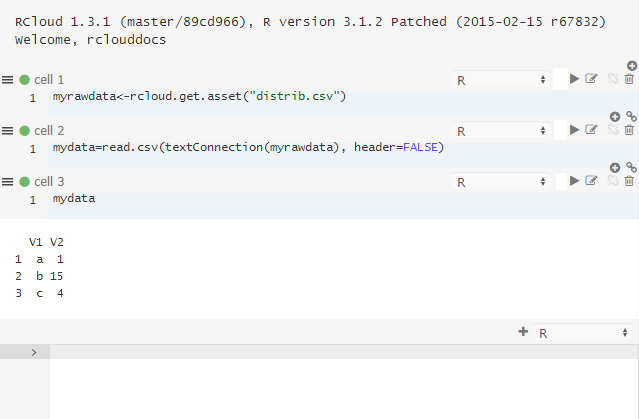

Uploading assets
----------------

In addition to manually entering asset text, you can also drag and drop files into the Assets panel to upload them:

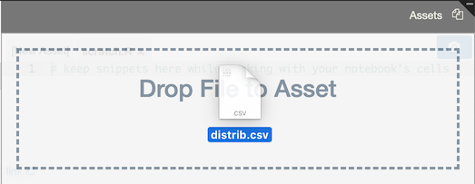

Assets Links
------------

RCloud automatically generates asset links and displays them in the lower left-hand corner of the Assets panel. To copy the URL, right-click on it.


Binary Assets
-------------

Assets can be binary (e.g. an image). RCloud transparently encodes and decodes using base-64 encoding. When possible, the content is displayed in its native format in the asset panel.

Asset size
----------

Assets are limited to 2.5MB each.

Cascading style sheets
----------------------

Assets can contain CSS formatting information. This changes the way information is presented when your notebook is executed. For example, here is a bit of CSS that defines a paragraph style:

    p.mystyle {
      font-size: 20px;
      color: red;
    }

To use this CSS as an asset, it needs to have a special name that begins with "rcloud-" and ends with ".css". In the example below, the name is "rcloud-mystyle.css".

RCloud automatically uses CSS asset files with this file pattern and ignores others, so you can save bits of CSS in other files without worrying about overlap.

To use the `mystyle` paragraph style, simply reference it in Markdown using HTML:

    # My Header

    Here is a bit of red text:

    <p class="mystyle">This is red.</p>


Note that you must reload your notebook to apply the CSS.

JavaScript
----------

Assets can also contain JavaScript. When editing JavaScript (files must have the .js extension), RCloud automatically uses a JavaScript editing mode, which has built-in syntax checking.


HTML Mode
---------

When editing HTML (files must have the .html or .htm extension), RCloud automatically uses an HTML editing mode, which has built-in syntax checking and tag completion.

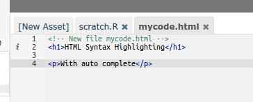

Renaming assets
---------------

To rename an asset, simply click on the file name on the asset's tab.


`notebook.R` URLs
=================

It's possible to construct a URL for a notebook asset accessing the GitHub or rcloud-gist-services backend directly, but this is cumbersome.

A better and more powerful way to access assets is via the HTTP entry point, `notebook.R`.

You can find the URL of the currently open asset by right-clicking the link at the lower left corner of the asset editor.


`notebook.R` allows you to access a notebook in the following ways:

    http://rcloud.mydomain.com/notebook.R/<notebook-id>
    http://rcloud.mydomain.com/notebook.R/<notebook-id>/<version-hash>
    http://rcloud.mydomain.com/notebook.R/<notebook-id>/<filename>
    http://rcloud.mydomain.com/notebook.R/<notebook-id>/<version-hash>/<filename>
    http://rcloud.mydomain.com/notebook.R/<user>/<notebook-name>
    http://rcloud.mydomain.com/notebook.R/<user>/<notebook-name>/<filename>

URLs ending in "&lt;filename&gt;" will return the given asset (file). To illustrate how it works using the previous example, any of these give HTTP access to the latest version of DummyData.csv:

    http://rcloud.mydomain.com/notebook.R/d2b9231aca224bbbb888/DummyData.csv
    http://rcloud.mydomain.com/notebook.R/rclouddocs/Asset%20API/DummyData.csv

Access to assets isn't the only thing you can do with `notebook.R`. Notice that in the list of ways to access your notebook above, not all methods reference a filename. If you reference a notebook or revision of a notebook, the URL will return the final result after evaluating the R cells in the notebook.

`notebook.R` is intended to be a general-purpose Remote Procedure Call (RPC) in R. RPCs in RCloud should always contain some [Markdown](#Markdowncells) to document what the RPC does, what the arguments are, etc. This way other users can simply view your notebook in RCloud to understand how to use it. This isn't enforced but is encouraged to promote reuse. The Markdown is only visible when users visit your notebook in RCloud. The Markdown is not output when called remotely.

Please see [the following](https://github.com/att/rcloud/blob/develop/NEWS.md#rcloud-09) for more `notebook.R` features and information.

`shared.R` URLs
===============

Files can be served from user R libraries via `shared.R/<user>/<package>`. Users can develop packages that use `shared.R` in their own development library until it is ready to be released.

Note that users are still responsible for setting the permissions on the library path — default permissions deny access, including to the web server, to user libraries.

Search
======

To conduct a global text search in all public RCloud notebooks, open up the search panel by clicking on Search on the left sidebar. Here are the results for a search on "markdown." RCloud searches code, comments, notebook names, assets, everything.

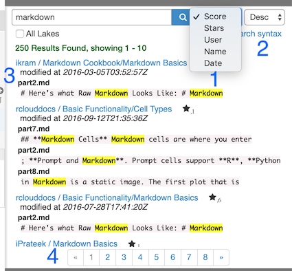

**1**: Results can be sorted by the number of stars a notebook has, the author of the notebook (User), the notebook's name, or by the date a notebook was created.

**2**: Sorts the results in descending (Desc) or ascending (Asc) order.

**3**: When too many results are returned for any one notebook, RCloud will display a Show me more link that will toggle the rest of the results.

**4**: Search results are paginated. Click on any page number below the results or use the  back or  next page to page through the results.

Complex searches
----------------

RCloud supports Lucene's feature-rich query parser syntax for more complex searches. Features include wildcard, fuzzy, and proximity searches, boolean operators, grouping, and much more.

Please see the [official query parser syntax documentation](http://lucene.apache.org/core/2_9_4/queryparsersyntax.html) for more information.

Settings
========

Various aspects of your RCloud environment parameters may be changed in the Settings section of the left Windowshade panel, including the default new notebook name.

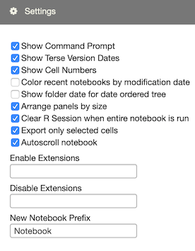

Show command prompt
-------------------

This setting toggles the appearance of the default prompt cell that appears at the bottom of the currently loaded notebook.

Show terse version dates
------------------------

This controls how RCloud displays dates when viewing notebook versions. When selected, RCloud will display dates and times only when they're different from the version before it.

Show cell numbers
-----------------

Toggles "Cell 1," "Cell 2," etc. in the cells panel.

Color recent notebooks by modification date
-------------------------------------------

Recent notebooks are colored according to the modification date, allowing you to
easily see which notebooks have recent modifications. Only folders containing
more than 38 notebooks will show colored rows.

Show folder date for date-ordered tree
--------------------------------------

Displays the most recent notebook modification date next to folders in the
notebooks pane.

Arrange panels by size
----------------------

In some situations, larger panels on the left-hand side of the GUI "crowd-out" the currently loaded notebook and force the user to resize. In order to minimize this, select the "Arrange Panel by Size" checkbox in the Settings panel. RCloud will then rearrange panels in order to reduce the need for resizing the notebook.

Clear R Session when entire notebook is run
-------------------------------------------

Runs notebooks as though you'd just logged in.

Export only selected cells
--------------------------

In the various export commands available in the Advanced header menu item, only export selected cells.

Autoscroll notebook
-------------------

When a cell generates more output than can be displayed on the screen, RCloud
will automatically scroll the Cells pane to keep the current output visible.

Extensions
----------

Power users can extend RCloud's user interface with global and per-user extensions. Although this functionality is outside the scope of this document, more information is available [here](https://github.com/att/rcloud/wiki/RCloud-UI-Extensions).

You can enable and disable extensions using the "Enable Extensions" and "Disable Extensions" text boxes. These set the user options `addons` and `skip-addons`, respectively. On starting the session, any extensions listed in `skip-addons` are not loaded.

Enter a list of extensions, comma delimited, and press enter. You will then have to reload the page.

New notebook prefixes
---------------------

Use the New Notebook Prefix setting to change how RCloud names [new notebooks](#creating-a-notebook).

Suppose you were working on a project, Foo. You might choose "Foo " for your new notebook prefix. New notebooks would be named "Foo 1," "Foo 2," and so on.

You can also include a folder. RCloud then places new notebooks within that folder in the notebook tree. For example, you may choose to make "Foo/Notebook " your new notebook prefix name. RCloud would create new notebooks "Foo/Notebook 1," "Foo/Notebook 2," and so on.

Comments
========

Anyone can leave comments about anyone's notebooks in the Comments panel in the right sidebar, as demonstrated below:

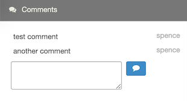

Comments are included in search results.

To submit a comment, simply input your text in the text area and click the comment icon . You can also submit your comment by pressing `Ctrl-Enter` (Win/Linux) or `Cmd-Enter` (Mac).

Editing comments
----------------

To edit a comment, click on the comment text to make changes. Then click `Ctrl-` or `Cmd-Enter` to update the comment.

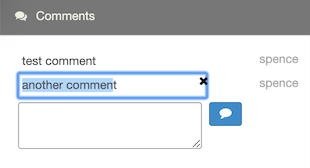

Deleting comments
-----------------

To delete a comment, hover your mouse over the comment. Click the X next to the comment to delete it.

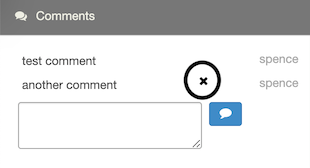

Help
====

It's often difficult to remember arguments to functions and what they mean, so RCloud has an inline help feature. In a new prompt cell, type a question mark immediately followed by an R function name and then press `Enter/Return` to execute the cell:

    ?print

If help is available, RCloud will open the Help panel:

<a href="img/help.png"></a>

Alternatively, you can enter a function name in the text box at the top of the panel and click the help icon .

Workspace
=========

In the course of working with your notebook, variables are defined and assigned. Often, it is convenient to know the value of a variable without issuing a command to display it. The Workspace panel displays every variable you've defined along with its value.

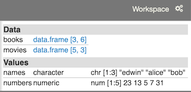

In the case of dataframe variables, a link is displayed, which will open up the [Dataframe panel](#dataframe).

Dataframe
=========

Dataframe objects are displayed here after you click a dataframe link in the [Workspace panel](#workspace) or use the View(object) command in a cell:

    View(books)

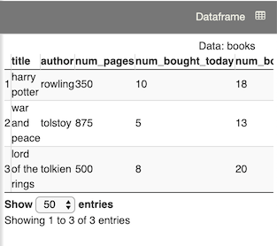

Session
=======

The session pane displays critical system information when available, such as session timeouts. The panel will automatically open when messages are available.

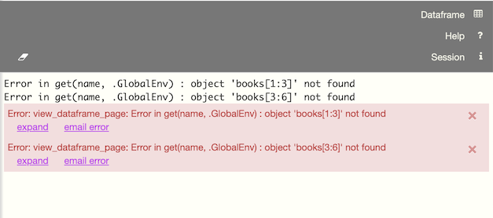

Click the  icon to dismiss a session notification.

Note that Session panel output is limited to 10K in order to improve responsiveness when there is a large amount of output.

RStudio Shiny Support
=====================

RCloud is 100% compatible with the [RStudio Shiny web application framework](http://shiny.rstudio.com) via the rcloud.shiny package. `rcloud.shiny` emulates a network connection to run Shiny on an RCloud server and client instead of a Shiny server.

Although comprehensive documentation of rcloud.shiny is beyond the scope of this document, the implementation is simple enough to get many users already familiar with Shiny started.

    # Include rcloud.shiny library
    library(rcloud.shiny)
    # Include all the libraries from ui.R and server.R
    library(datasets)

    # The rcloud.shinyApp function is the equivalent of the shinyApp
    # (http://rmarkdown.rstudio.com/authoring_embedded_shiny.html#inline-applications)
    # function in shiny library.
    rcloud.shinyApp(
                
        # Pass the ui.R code something as shown below. 
      ui = fluidPage(

        # Application title
        headerPanel("Word Cloud"),
        .
        .
        .
        etc.

To learn more about how to use Shiny in RCloud, please see the `rcloud.shiny` example notebooks under RCloud Sample Notebooks in the Notebooks panel and the [official Shiny documentation](http://shiny.rstudio.com/).

Keyboard Shortcuts
==================

RCloud supports many keyboard shortcuts. To see an exhaustive list, click in a blank area of the RCloud GUI (so that the cursor focus is not in a cell, for example) and then type `?`.


